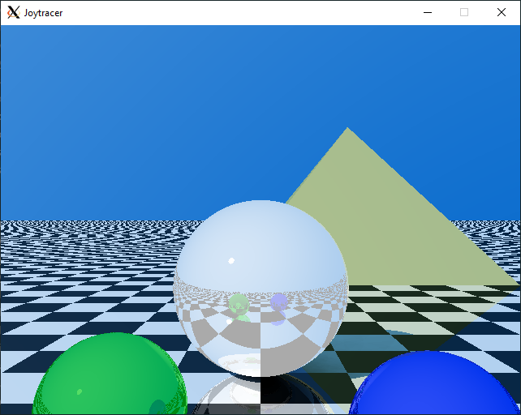

# joytracer - a raytracer demo



This project is a raytracer demo. The purpose of this project is to learn as much as possible about C++11, 14, and 17.

## Requirements

This is what I am using:

* gcc and clang alternately.
* cmake 3.6
* SDL 2 library
* Boost 1.72

## Building

To build the project, type the commands:

```sh
export CC=/usr/bin/clang
export CXX=/usr/bin/clang++
mkdir build
cd build
cmake ..
make
```

On MSYS, run the build like this:

```sh
export CC=/mingw64/bin/clang
export CXX=/mingw64/bin/clang++
mkdir build
cd build
cmake -G"MSYS Makefiles" ..
mingw32-make
```

## Running the app

I provided a test scene xml file, run the program with the command:

```sh
./joytracer ../scenes/test_scene.xml
```

Enjoy!
